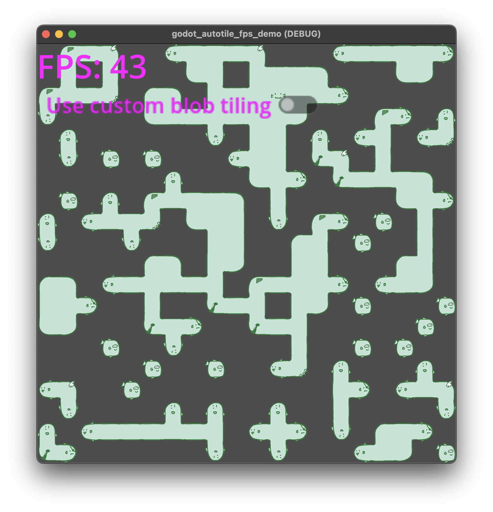
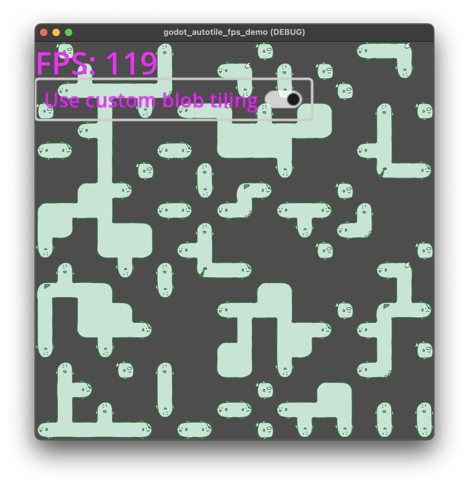

# godot_autotile_fps_demo

Demonstrates that your fps drops if you redraw tiles every frame using Godot's terrain autotiling.

## Setup
- 1280x1280 window
- Tileset with 64x64 "Texure Region Size", 64x64 "Tile Size" and 64x64 "Cell Quadrant Size"
- Tilemap with 20x20 grid of tiles
- Clears TileMap and randomly sets a subset of tiles once per frame ([TileDrawer.gd](TileDrawer.gd))
- Option to turn on custom specialized implemention of blob tiling

## Screenshots

